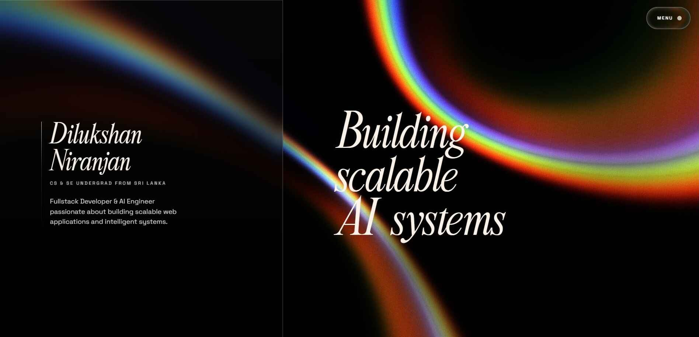

<picture>
    
</picture>

<div align="center">

[](https://astro.build)
[](https://react.dev)
[](https://typescriptlang.org)
[](https://tailwindcss.com)
[](https://greensock.com/gsap)
[](https://cloudflare.com)

</div>

### Second iteration of a personal portfolio built with Astro, React, Tailwind CSS v4, and Cloudflare. The site combines editorial-style typography, animated transitions, interactive project showcases, and motion-driven UI experiments to present work, certifications, and technical interests in a more immersive way than a standard portfolio grid.

## Overview

This project is a single-page portfolio for Dilukshan Niranjan. It includes:

- A full-screen animated landing experience with a preloader and shader-like background effects
- Interactive project cards rendered client-side with GSAP and Lenis-powered motion
- A technology stack section with hover-reactive highlights
- A certifications section with animated previews
- Astro-first rendering with React used for visual UI components
- Cloudflare-ready deployment via the Astro Cloudflare adapter

## Tech Stack

- Astro 6
- React 19
- TypeScript
- Tailwind CSS v4
- GSAP
- Anime.js
- Lenis
- OGL / Three.js
- Cloudflare Workers via `@astrojs/cloudflare`

## Getting Started

### Prerequisites

- Node.js `22.12.0` or newer
- npm

### Install dependencies

```sh
npm install
```

### Start the development server

```sh
npm run dev
```

Astro will start the local dev server, typically at [http://localhost:4321](http://localhost:4321).

## Available Scripts

| Command                  | Description                                    |
| ------------------------ | ---------------------------------------------- |
| `npm run dev`            | Start the local Astro development server       |
| `npm run build`          | Build the production site into `dist/`         |
| `npm run preview`        | Preview the production build locally           |
| `npm run generate-types` | Generate Cloudflare Worker types with Wrangler |
| `npm run astro`          | Run Astro CLI commands                         |

## Project Structure

```text
.
├── public/                  # Static images, icons, model, and showcase assets
├── src/
│   ├── assets/              # Local font assets
│   ├── components/          # Portfolio sections and interactive UI pieces
│   ├── data/                # Static portfolio data
│   ├── lib/                 # Small shared utilities
│   ├── pages/               # Astro routes
│   └── styles/              # Global styles
├── astro.config.mjs         # Astro config, local font setup, Cloudflare adapter
├── wrangler.jsonc           # Cloudflare Worker/assets configuration
├── package.json
└── tsconfig.json
```

## Key Files

- `src/pages/index.astro`: main page composition
- `src/components/LandingPage.astro`: hero section, preloader, and intro animation
- `src/components/Projects.astro`: animated projects showcase
- `src/components/Technologies.astro`: interactive tech stack grid
- `src/components/Certifications.astro`: certifications list with hover preview behavior
- `src/components/ui/*`: reusable visual effects and React-based UI building blocks

## Deployment

This project is configured for Cloudflare using the Astro Cloudflare adapter.

### Build

```sh
npm run build
```

### Preview locally

```sh
npm run preview
```

If you plan to deploy with Wrangler, make sure your Cloudflare account and project settings are configured appropriately for the worker defined in [`wrangler.jsonc`](/D:/Programming/Astro/portfolio-v2/wrangler.jsonc).
